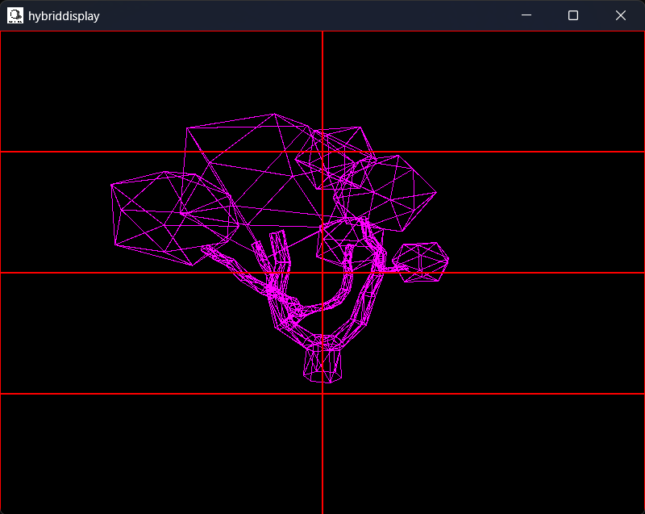
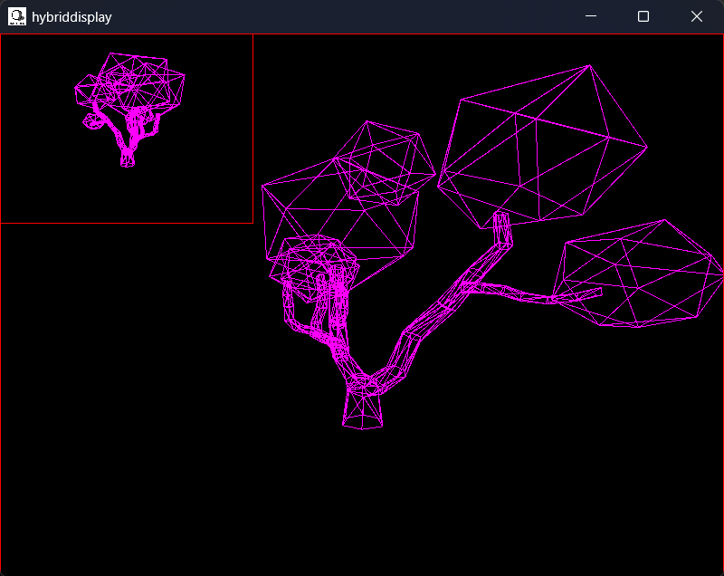

#  hybriddisplay
Started: August 8th, 2026  

## 📝 About
hybriddisplay is a C++23 CPU rasterizer/raytracing hybrid rendering engine. It is the predecessor to <a href="https://github.com/pearson-kai/superdisplay">superdisplay</a>. Below you can find some of the features first seen in superdisplay, and the additions to those features that will come in hybriddisplay.

| superdisplay | hybriddisplay |
|----------|------------|
| Full perspective CPU rasterization | CPU rasterization and ray tracing options |
| .obj file compatability | Multithreaded rendering (with load balancing) |
| Modular screen options and rendering settings | Textures and normal mapping |
|   | Mesh normal interpolation |
|   | Viewport camera options |
|   | Lambert diffuse lighting |

| Multithreaded Tiled Render Example | Multiple Viewport Render Example |
| ---------- | ---------- |
|  |  |

## ⚙️ Architecture

### Namespaces

All source code for hybriddisplay is organized in 6 namespaces, all under the `hybriddisplay::` parent namespace.

| Namespace | Responsibility |
|----------|------------|
| `math::` | Vec3 and Transform classes. |
| `graphics::` | Materials, colours, and texture mapping. |
| `geometry::` | Vertex, triangle, and mesh storage. |
| `display::` | Wrapper for SDL3 window and texture uploading. |
| `rendering::` | Rendering and pixel painting functions. |
| `threading::` | Multithreading managment objects and functions. |

### Threading

One of the core features of hybriddisplay over superdisplay is the addition of multithreading. To prevent repeaded thread creation and deletion, threads are usually created at the start of the program and stored into a Pool class. The hope is that when there are large chunks of work to be done, tasks can be fed into the Pool, performed, and then the threads in the Pool can go back to sleep.

Much of this is done with lambda functions, where regular function calls are replaced with no argument, conditionally disabled functions. This stems from the fact that all functions that we pass into our Pool have to have the same signature. In this case, we work to make that function signature `std::function<void()>`.

A function like `void foo(int value, Object& obj);` can be turned into a no arg lambda function like this:

- `std::function<void()> fooLambda = \[myObj&\](){ foo(12,myObj); };`
- `fooLambda();`

And then we can pass that into a queue, where threads that are asleep can wake up and perform the job. This is convenient for tasks like model transforms, and expensive draw calls. When rendering a frame we split up the number of vertices in a model based on the number of threads we have in our pool, and allocate space for each thread to be able to write to an array. Threads perform the vertex transformation math and write their results in their allocated memory. 

Performing actions with Pool does contain overhead: each function call from the queue comes with it's own Mutex work, but being able to chop a single expensive function into multiple cheaper functions to have multiple cores in your CPU work on has cut frame time dramatically. 

### Rendering

The rendering code can be found in `src/Renderer.cpp`, where you can see different implimentations such as wireframe, rasterize, and raytrace. As development of this project continues, more of these functions will have proper implimentations.

One of the core goals for hybriddisplay is having a flexible and dynamic rendering pipeline. With the different rendering options, you can effectively layer effects on top of each other.

Consider a pipeline like this:
1. clearBuffer()
2. rasterize(viewport, camera, world)
3. clearZBuffer()
4. wireframe(viewport, camera, objectworld)
5. presentFrame()

In this pipeline, a scene is being presented, and a wireframe of a single object inside that world is being presented after. Because we clear the z-buffer though between rasterizing and presenting the wireframe, the wireframe will have "priority" over the rasterization, giving an xray look to the object in the other world.

Rendering functions are passed 3 things:
- Viewport (pointer to the necessary buffers, and boundaries to print in)
- Camera (scene transform information)
- World (collection of models and light sources)

### Display and SDL3 Integration

This project uses SDL3's `SDL_Window` and `SDL_Texture` objects to display graphics. All implimentation code tied to SDL3 can be found in `src/Screen.cpp`. 

The general flow of information to the screen takes place from the frame buffer. The frame buffer in the `display::Screen` class is a vector of colours, the same size as the `SDL_Window`. The `graphics::Colour` consists of 4 uint8_t values: r, g, b, a. When the screen is ready to present something, the frame buffer is copied into an `SDL_Texture`, which is an optimized data structure specifically designed to then connect and display itself in the `SDL_Window`.

## 📩 Contact
Author: Kai Pearson  
Email: kaipearson@dal.ca  
GitHub: pearsonkai  
